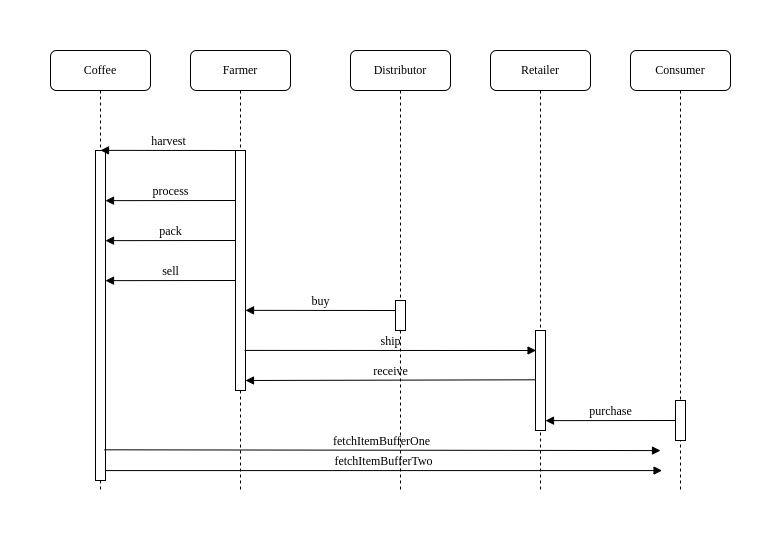

# Supply chain & data auditing

This repository containts an Ethereum DApp that demonstrates a Supply Chain flow between a few parties, a Farmer, a Distributor, a Retailer and a Consumer. The user story is similar to any commonly used supply chain process. A Farmer can add coffee items to the inventory by harvesting them,then same Farmer can process, pack and put the item for sale.A Distributor can Buy and Ship the item and lastly Retailer can mark it as Received and Consumer set the item as Purchased. Every action has to be made by an actor with the required respective role. The interface will let the connected user know if it posses the required role already as well as it offers a little tool with an interface to check other accouns as well as set role for certain accounts. Account roles can be set only by someone that has same role already. So Distributor can and A distributor, Farmer a Farmer etc. The Owner of the contract has by default all 4 roles and ca be the initial source of role granting. 
A mention on the interface of the app is that each it is separted in sections of actions delimited by the action buttons. Each section has an UPC field that is releveant to that section alone, that permits to query data for an itme with a certain UPC, while performing Harvesting on another, while setting another UPC as Received etc. 
Bottom of the interface should show a list of transaction that are being made.
While not exhaustive, the interace is trying to help the user by validating form before an action and showing error in case soemthing went wrong. Fields that aren't suppose to be edited, can't be edited. Active ID fields are auto populated with the connected account and are present for each section of the app, to be easier to understand who is doing the action and on what item with the sepcific UPC.

## How it looks (user interface)


## How it works (diagrams)
### Activity Diagram

### Sequence Diagram

### State Diagram

### Data Diagram


## Getting Started

These instructions will get you a copy of the project up and running on your local machine for development and testing purposes. See deployment for notes on how to deploy the project on a live system.

### Prerequisites

Please make sure you've already installed ganache-cli, Truffle and enabled MetaMask extension in your browser.

```
Give examples (to be clarified)
```

### Installing

> The starter code is written for **Solidity v0.5.16**. At the time of writing, the current Truffle v5 comes with Solidity v0.5, thus the change for theinitial boiler plate solidity version.

A step by step series of examples that tell you have to get a development env running

Clone this repository:

```
git clone https://github.com/Symyon/supply-chain-dapp.git
```

Change directory to ```project-6``` folder and install all requisite npm packages (as listed in ```package.json```):

```
cd project-6
npm install
```

Launch Ganache:

```
ganache-cli -m "spirit supply whale amount human item harsh scare congress discover talent hamster"
```

Your terminal should look something like this:


In a separate terminal window, Compile smart contracts:

```
truffle compile
```

Your terminal should look something like this:


This will create the smart contract artifacts in folder ```build\contracts```.

Migrate smart contracts to the locally running blockchain, ganache-cli:

```
truffle migrate
```

Your terminal should look something like this:


Test smart contracts:

```
truffle test
```

All 10 tests should pass.


In a separate terminal window, launch the DApp:

```
npm run dev
```

## Built With

* [Ethereum](https://www.ethereum.org/) - Ethereum is a decentralized platform that runs smart contracts
* [IPFS](https://ipfs.io/) - IPFS is the Distributed Web | A peer-to-peer hypermedia protocol
to make the web faster, safer, and more open.
* [Truffle Framework](http://truffleframework.com/) - Truffle is the most popular development framework for Ethereum with a mission to make your life a whole lot easier.

## Notable Libraries used
* web3 - for blockchain interaction
* @truffle/hdwallet-provider - for the possibility of performing transactions (sign/send ETH) through a web/browser wallet.

## Authors

The project is a forc from the Udacity boiler plate project offered in the Blockchain Developer Nanodegree program:
https://github.com/udacity/nd1309-Project-6b-Example-Template

All other changes are made by @symyon

## Acknowledgments

* Solidity
* Ganache-cli
* Truffle
* IPFS
